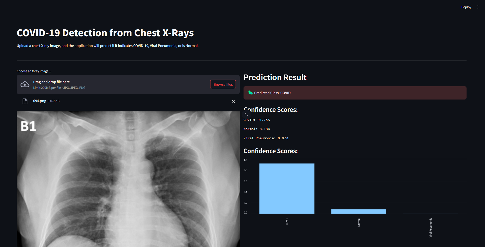

# 🩺 Chest X-Ray Disease Prediction (CXR-Diagnostics)



An end-to-end deep learning solution for classifying chest X-ray images into three categories: **COVID-19**, **Normal**, and **Viral Pneumonia**. This project features a fine-tuned ResNet50 model, optimized with TensorFlow Lite, and deployed as an interactive web application using Streamlit.

---

## Problem Statement

The timely and accurate diagnosis of respiratory diseases like COVID-19 and Viral Pneumonia is crucial for patient treatment and controlling public health crises. Manual analysis of chest X-rays can be time-consuming and requires expert radiologists. This project aims to address this challenge by developing an automated tool that uses deep learning to provide a fast, accurate, and accessible preliminary diagnosis from chest X-ray images, assisting healthcare professionals in the screening process.

---

## Live Demo Preview

Here is a preview of the final Streamlit web application in action.

*[A GIF or screenshot showing the web application: user uploading an X-ray and receiving a prediction result]*

---

## Features

-   **Multi-Class Classification:** Accurately distinguishes between COVID-19, Normal, and Viral Pneumonia.
-   **High-Performance Model:** Built using transfer learning with a fine-tuned **ResNet50** architecture, achieving **over 96% accuracy** on the test set.
-   **Model Optimization:** The final model was quantized using **TensorFlow Lite**, reducing its size by ~75% (from 240 MB to ~60 MB) for efficient deployment.
-   **Interactive Web Application:** A user-friendly and responsive web interface built with **Streamlit** for easy image uploads and instant prediction results.
-   **Deployment Ready:** The application is structured and prepared for one-click deployment on Streamlit Community Cloud.

---

## Methodology

The project was executed in several key phases:

1.  **Data Preprocessing:** The image dataset was loaded and preprocessed on the fly using Keras's `ImageDataGenerator`. This included resizing all images to a consistent 224x224, applying aggressive data augmentation (rotation, zoom, flips) to prevent overfitting, and normalizing pixel values.
2.  **Model Building:** A **ResNet50** model, pre-trained on the ImageNet dataset, was used as the base. The top classification layer was removed and replaced with a new custom head suitable for our three classes.
3.  **Training & Fine-Tuning:** The model was trained in two phases:
    -   First, only the custom head was trained with the base model's layers frozen.
    -   Then, the final few blocks of the base model were unfrozen and the entire model was fine-tuned with a very low learning rate to adapt its features to the X-ray data. **Class weights** were used to handle the imbalanced dataset.
4.  **Model Quantization:** After training, the final `.keras` model was converted to a `.tflite` (TensorFlow Lite) model. **Post-training quantization** was applied to reduce the file size and improve inference speed.
5.  **Application Development:** An interactive web application was developed using **Streamlit** to provide an easy-to-use interface for the model.

---

## Tech Stack

| Category                     | Technologies & Tools                                                              |
| ---------------------------- | --------------------------------------------------------------------------------- |
| **Machine Learning** | `TensorFlow`, `Keras`, `Scikit-learn`, `NumPy`, `Pillow`, `OpenCV`                  |
| **Web Application** | `Streamlit`                                                                       |
| **Deployment & Version Control** | `Git`, `Git LFS`, `GitHub`, `Anaconda`                                            |

---

## Model Performance

The model's performance was evaluated on a held-out test set, demonstrating high accuracy and balanced precision/recall across all classes.

| Class             | Precision | Recall | F1-Score |
| ----------------- | --------- | ------ | -------- |
| **COVID** | 1.00     | 0.80   | 0.89     |
| **Normal** | 0.70      | 0.95   | 0.80     |
| **Viral Pneumonia** | 0.94      | 0.85   | 0.89     |
| **Overall Accuracy**|           |        | **86.3%**|

---

## Getting Started

Follow these steps to set up and run the project on your local machine.

### 1. Prerequisites
-   [Anaconda](https://www.anaconda.com/products/distribution) installed.
-   [Git](https://git-scm.com/downloads) and [Git LFS](https://git-lfs.github.com/) installed.

### 2. Clone the Repository
```
# Install Git LFS (only needs to be done once per machine)
git lfs install

# Clone the repository
git clone [https://github.com/itz-Mayank/Chest-X-Ray-Diagnostics.git](https://github.com/itz-Mayank/Chest-X-Ray-Diagnostics.git)
cd Chest-X-Ray-Diagnostics.git
```

### 3. Set Up the Environment
# Create and activate a new Conda environment
```
conda create -n cxr_diagnostics python=3.10 -y
conda activate cxr_diagnostics
```

### 4. Install Dependencies
```
pip install -r requirements.txt
```

### 5. Run the Application
```
streamlit run app.py
```
The application will open in your web browser at http://localhost:8501.

## Author
Created and developed by `Mayank Meghwal`.